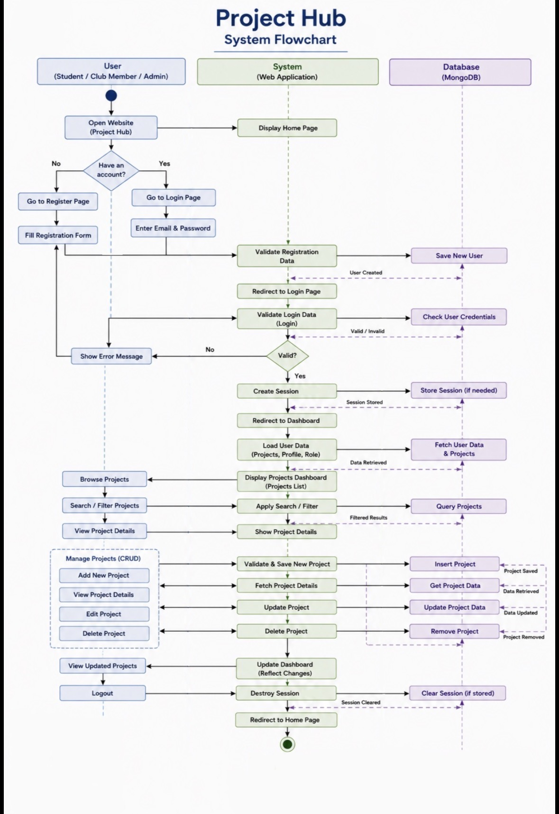
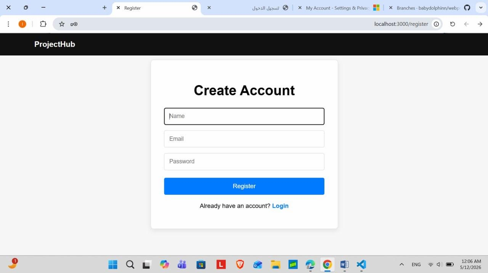
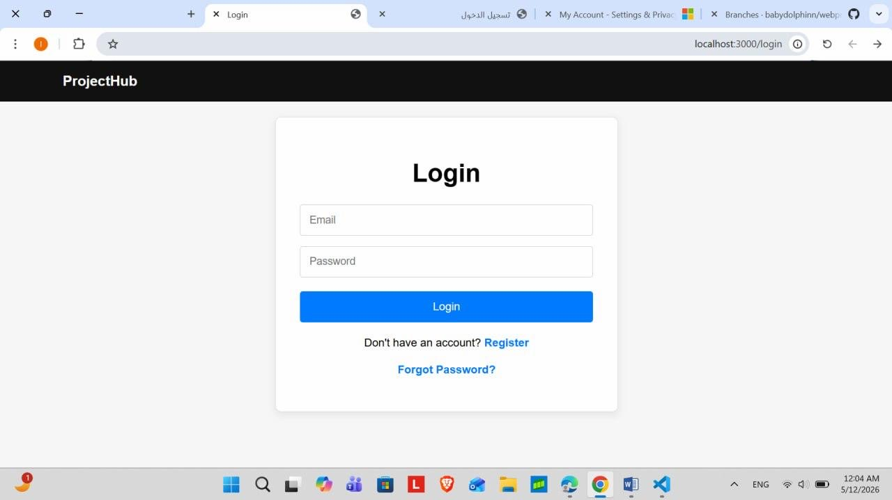
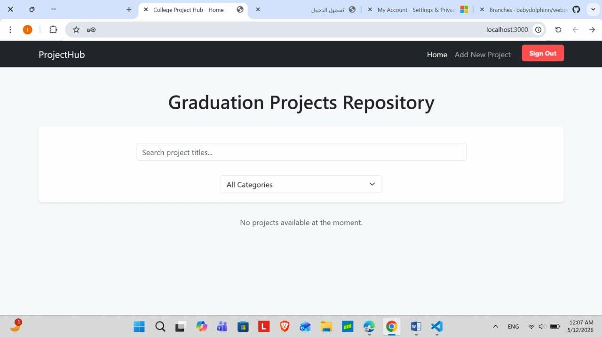
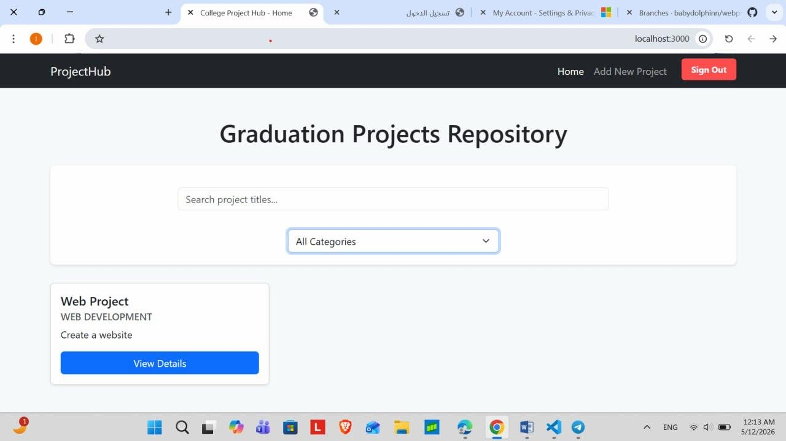
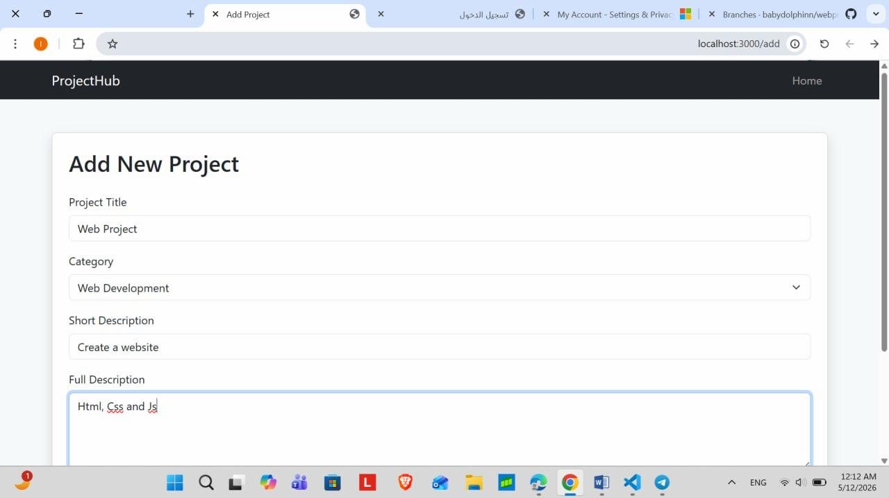
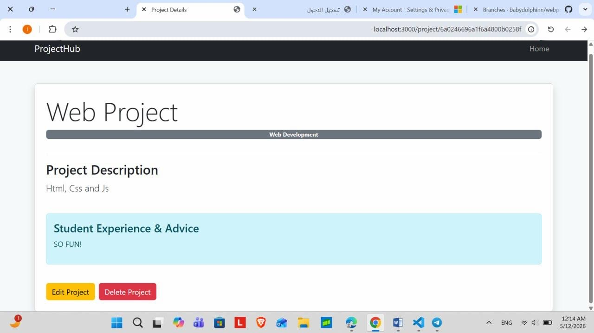

# Graduation Project Hub

## Overview

Graduation Project Hub is a centralized web-based platform tailored for university students to document, share, and explore graduation project concepts. By providing a searchable repository of past experiences and technical recommendations, the platform fosters innovation and helps prevent the duplication of project ideas within the CCIS department.

-----------------------------------------

## System Flow Chart



> Note: This diagram illustrates the user journey from secure authentication to performing CRUD operations on the project database.

-----------------------------------------

## Project Goals

### Knowledge Preservation
Capture lessons learned and technical advice from graduating seniors for the benefit of future cohorts.

### Academic Innovation
Provide a searchable database to help students identify unique niches and avoid repetitive project topics.

### Collaborative Learning
Build a community-driven space where technical resources and project hurdles are shared openly.

-----------------------------------------

## Setup and Installation

To run this project on a local development server, follow these steps:

### 1. Clone the Repository

```bash
git clone https://github.com/babydolphinn/webproject.git
```

### 2. Install Dependencies

Navigate to the project root and run:

```bash
npm install
```

### 3. Database Configuration

The application connects to a MongoDB Atlas cloud cluster. Ensure the connection string in `app.js` is correctly configured with valid credentials.

### 4. Start the Server

```bash
node app.js
```

### 5. View the Application

Open your browser and navigate to:

```text
http://localhost:3000
```

-----------------------------------------

## Technologies Used

### Backend
- Node.js
- Express.js
- RESTful API architecture

### Database
- MongoDB Atlas

### Frontend
- EJS (Embedded JavaScript)
- Bootstrap 5
- HTML
- CSS
- JavaScript

### Security
- Bcrypt for password hashing
- Express-Session for authentication handling

### Utilities
- Nodemailer for email services
- Crypto for secure token generation

-----------------------------------------

## Key Features

### Full CRUD Lifecycle
Users can Create, Read, Update, and Delete project entries through a fully functional REST API.

### Dynamic Search and Filtering
Projects can be filtered dynamically by category or searched using title keywords in real time.

### Protected Routes
The `isAuthenticated` middleware ensures that only logged-in users can access dashboard and management functionalities.

### Distinguishing Feature — Password Recovery
A secure email-based password reset system uses time-limited tokens to allow users to recover accounts safely.

-----------------------------------------

## System Screenshots
## System Screenshots

## System Screenshots

## System Screenshots

### User Registration Page


### User Login Page


### Home Page with Search and Category Filtering


### Project Repository Dashboard


### Add New Project Page


### Project Details and Student Experience Page


-----------------------------------------

## Future Work

### Peer Engagement
Implementing a rating and commenting system for collaborative feedback.

### AI Recommendations
Integrating an NLP-based recommendation engine to suggest project ideas based on student interests.

### Document Hosting
Adding support for direct PDF uploads of final project reports and presentations.

-----------------------------------------

## Resources

- Express.js Documentation: https://expressjs.com/
- MongoDB Atlas: https://www.mongodb.com/cloud/atlas
- Bootstrap 5 Documentation: https://getbootstrap.com/
- Nodemailer Documentation: https://nodemailer.com/

-----------------------------------------

## Team Members and Responsibilities

- Alanoud — Authentication and Security
- Ghadeer — Project Display and Detailed View
- Lara — Core CRUD Operations
- Shaden — Search System Implementation, Dynamic Filtering, UI/UX Design, and README Documentation
